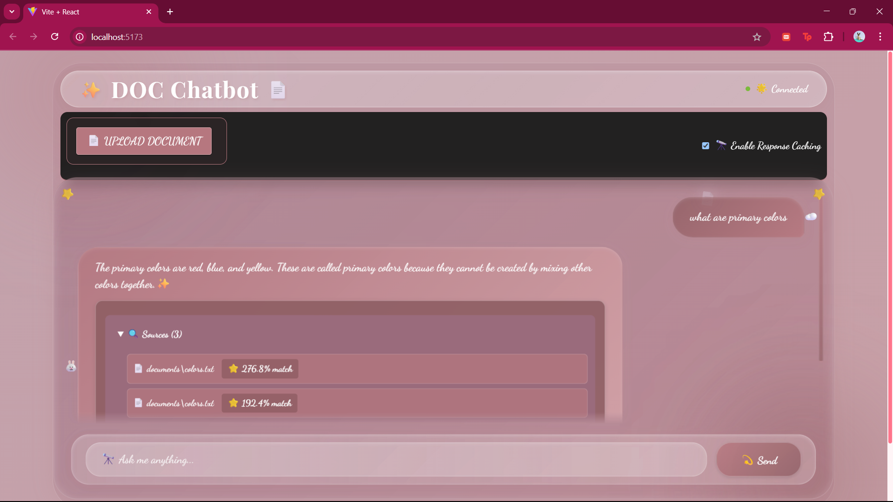
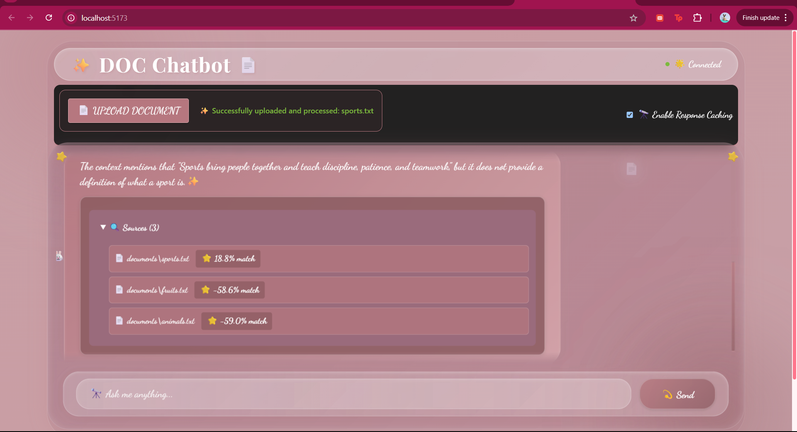

# 📄 DOC Chatbot

Meet **Doc Chatbot**: Your intelligent conversational partner, engineered to revolutionize how you interact with your documents. Say goodbye to tedious keyword searches; Doc Chatbot leverages a state-of-the-art **Retrieval-Augmented Generation (RAG)** pipeline to provide nuanced, context-aware answers drawn directly from your PDFs, TXT, and DOCX files. All of this power is wrapped in a beautifully designed, intuitive user interface for a seamless and productive experience.

---

## 🚀 Features

### 🎓 Effortless Document Ingestion & Advanced Processing
- **Versatile File Support**: Simply upload your PDFs, TXT, or DOCX files.
- **Intelligent Content Structuring**: Our sophisticated backend, powered by Langchain, intelligently processes and chunks your documents, meticulously preparing them for deep contextual understanding.
- **High-Performance Vector Storage**: Embeddings are efficiently generated and managed in a Chroma vector database, ensuring lightning-fast and accurate information retrieval.

### 💬 Dynamic & Engaging Conversational Interface
- **Fluid Real-Time Interaction**: Experience a truly interactive chat with instant responses.
- **Contextual Memory**: Doc Chatbot remembers the last few turns of your conversation (up to 6 messages), allowing for more natural follow-up questions and coherent dialogue.
- **Source-Aware & Transparent**: Get answers you can trust. Doc Chatbot not only provides information but also cites the specific sources within your documents, offering complete transparency.
- **Polished User Experience**: Enjoy a smooth interface with thoughtful details like typing indicators and a clear message history.

### 🔍 Next-Generation RAG Intelligence
- **Hybrid Search Power**: Our advanced RAG pipeline employs a powerful hybrid search strategy, combining semantic understanding with keyword precision to pinpoint the most relevant information within your documents.
- **Cutting-Edge Answer Generation**: Answers are synthesized by high-performance GROQ LLMs, ensuring accuracy, coherence, and natural language delivery.

### ⚡ Performance-Optimized Architecture
- **Rapid Vectorized Search**: Experience near-instantaneous search results thanks to highly optimized vectorized query processing.
- **Efficient Processing**: Benefit from intelligent chunk caching and batch embedding strategies that maximize speed and resource utilization.
- **Adaptive Model Loading**: The system is designed to be resource-aware, adapting model loading for optimal performance on both CPU and GPU setups.

### 🌐 Sleek & Modern User Experience
- **Visually Stunning Frontend**: Interact with a cutting-edge interface built with React and Vite, featuring contemporary styling that's both beautiful and functional.
- **Fully Responsive Design**: Enjoy a flawless experience across all devices, from desktops to tablets and smartphones.
- **Smooth & Intuitive Interactions**: Navigate with ease thanks to smooth UI animations and an intuitive layout that makes interacting with your documents a pleasure.

---

## 📸 Screenshots

### 🧠 Chat in Action  



---

## 🛠️ Tech Stack

### Backend
- FastAPI · LangChain · GROQ API
- ChromaDB · PyPDF2 · Spacy
- Sentence Transformers · Torch

### Frontend
- React (Vite) · TailwindCSS or Custom CSS
- Axios · Zustand / Redux (optional)

---

## ⚙️ Quick Start with Docker

### Prerequisites
- Docker & Docker Compose
- GROQ API Key

### 🧪 One-Step Setup
```bash
git clone https://github.com/yourusername/doc-chatbot.git
cd doc-chatbot
```

Create environment files:

```bash
# backend/.env
echo "GROQ_API_KEY=your_api_key_here" > backend/.env

# frontend/.env
echo "VITE_API_URL=http://localhost:8000" > frontend/.env
```

Run the app:
```bash
docker-compose up --build
```

Access:
- Frontend: http://localhost:5173  
- API: http://localhost:8000  
- Docs: http://localhost:8000/docs

---

## 🧰 Manual Setup (Dev)

### 🔧 Backend
```bash
cd backend
python -m venv venv
venv\Scripts\activate  # On Linux/macOS: source venv/bin/activate
pip install -r requirements.txt
```

**Note:** Some dependencies in `requirements.txt` (e.g., `onnxruntime`) might have complex build requirements. If you encounter issues, using the Docker setup is highly recommended for a smoother experience.

```bash
uvicorn main:app --reload
```

### 🎨 Frontend
```bash
cd frontend
npm install
npm run dev
```

---

## 🧱 Project Structure
```
doc-chatbot/
├── backend/
│   ├── documents/        # Uploaded documents
│   ├── vectorstore/      # Chroma vectors
│   ├── prepare_data.py   # RAG processing
│   └── main.py           # FastAPI server
├── frontend/
│   ├── src/
│   │   ├── components/   # UI Components
│   │   └── styles/       # Styling
│   └── vite.config.ts
└── docker-compose.yml
```

---

## 🔐 Environment Variables

### 📦 Backend (.env)
```env
GROQ_API_KEY=your_api_key_here
EMBEDDING_MODEL=all-MiniLM-L6-v2
EMBEDDING_DEVICE=cpu
```

### 🎯 Frontend (.env)
```env
VITE_API_URL=http://localhost:8000
```

---

## ☁️ Deployment

### 🐳 Docker (Recommended)
- Configure `.env` files
- Build and deploy with:
  ```bash
  docker-compose up --build -d
  ```

### 🌍 Manual
- Backend: Deploy on Railway, Fly.io, or Heroku
- Frontend: Deploy on Vercel or Netlify
- Set correct environment variables on each platform

---

## 🤝 Contributing

1. Fork this repo
2. Create a branch: `git checkout -b feature/AmazingFeature`
3. Commit: `git commit -m 'Add some AmazingFeature'`
4. Push: `git push origin feature/AmazingFeature`
5. Submit a pull request 🚀

---

## 🙏 Acknowledgments

- [GROQ](https://groq.com/) for blazing-fast LLMs
- [LangChain](https://www.langchain.com/) for the RAG framework
- [Chroma](https://www.trychroma.com/) for vector storage
- The open-source community ❤️

-----

Crafted with ❤️ by Ruchi Shaktawat 🚀

Thank you for checking out the Doc Chat-bot! If you have any feedback or suggestions, feel free to reach out.
