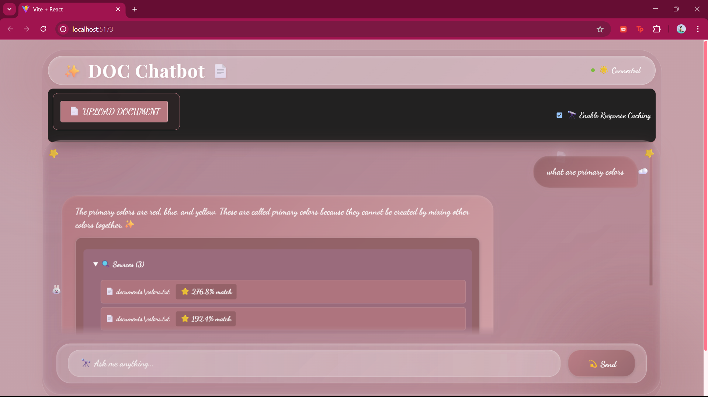

# 📄 DOC Chatbot

An elegant, document-powered chatbot that combines powerful RAG (Retrieval-Augmented Generation) pipelines with a sleek modern UI.


---

## 🚀 Features

### 🎓 Document Upload & Processing
- Supports PDF, TXT, DOCX files
- Intelligent chunking with Langchain
- Chroma vector embedding storage

### 💬 Conversational Interface
- Interactive real-time chat
- Source-aware answers
- Typing indicators & message history

### 🔍 Smart Search (RAG)
- Semantic + keyword hybrid retrieval
- Source attribution for transparency
- Answer generation using GROQ LLMs

### ⚡ Performance Optimized
- Vectorized search for speed
- Chunk caching & batch embedding
- Device-aware model loading (CPU/GPU)

### 🌐 Elegant Frontend
- React + Vite with modern styling
- Responsive layout
- Smooth UI animations

---

## 📸 Screenshots

### 🧠 Chat in Action  



---

## 🛠️ Tech Stack

### Backend
- FastAPI · LangChain · GROQ API
- ChromaDB · PyPDF2 · Spacy
- Sentence Transformers · Torch

### Frontend
- React (Vite) · TailwindCSS or Custom CSS
- Axios · Zustand / Redux (optional)

---

## ⚙️ Quick Start with Docker

### Prerequisites
- Docker & Docker Compose
- GROQ API Key

### 🧪 One-Step Setup
```bash
git clone https://github.com/yourusername/doc-chatbot.git
cd doc-chatbot
```

Create environment files:

```bash
# backend/.env
echo "GROQ_API_KEY=your_api_key_here" > backend/.env

# frontend/.env
echo "VITE_API_URL=http://localhost:8000" > frontend/.env
```

Run the app:
```bash
docker-compose up --build
```

Access:
- Frontend: http://localhost:5173  
- API: http://localhost:8000  
- Docs: http://localhost:8000/docs

---

## 🧰 Manual Setup (Dev)

### 🔧 Backend
```bash
cd backend
python -m venv venv
venv\Scripts\activate  # On Linux/macOS: source venv/bin/activate
pip install -r requirements.txt
uvicorn main:app --reload
```

### 🎨 Frontend
```bash
cd frontend
npm install
npm run dev
```

---

## 🧱 Project Structure
```
doc-chatbot/
├── backend/
│   ├── documents/        # Uploaded documents
│   ├── vectorstore/      # Chroma vectors
│   ├── prepare_data.py   # RAG processing
│   └── main.py           # FastAPI server
├── frontend/
│   ├── src/
│   │   ├── components/   # UI Components
│   │   └── styles/       # Styling
│   └── vite.config.ts
└── docker-compose.yml
```

---

## 🔐 Environment Variables

### 📦 Backend (.env)
```env
GROQ_API_KEY=your_api_key_here
EMBEDDING_MODEL=all-MiniLM-L6-v2
EMBEDDING_DEVICE=cpu
```

### 🎯 Frontend (.env)
```env
VITE_API_URL=http://localhost:8000
```

---

## ☁️ Deployment

### 🐳 Docker (Recommended)
- Configure `.env` files
- Build and deploy with:
  ```bash
  docker-compose up --build -d
  ```

### 🌍 Manual
- Backend: Deploy on Railway, Fly.io, or Heroku
- Frontend: Deploy on Vercel or Netlify
- Set correct environment variables on each platform

---

## 🤝 Contributing

1. Fork this repo
2. Create a branch: `git checkout -b feature/AmazingFeature`
3. Commit: `git commit -m 'Add some AmazingFeature'`
4. Push: `git push origin feature/AmazingFeature`
5. Submit a pull request 🚀

---


## 🙏 Acknowledgments

- [GROQ](https://groq.com/) for blazing-fast LLMs
- [LangChain](https://www.langchain.com/) for the RAG framework
- [Chroma](https://www.trychroma.com/) for vector storage
- The open-source community ❤️

-----

Crafted with ❤️ by Ruchi Shaktawat 🚀

Thank you for checking out the Doc Chat-bot! If you have any feedback or suggestions, feel free to reach out.
