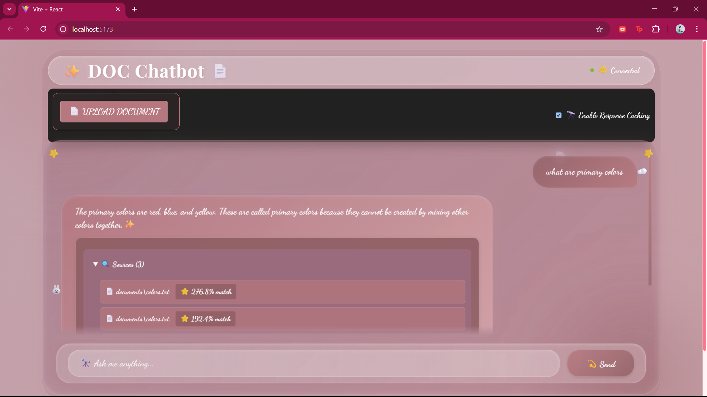
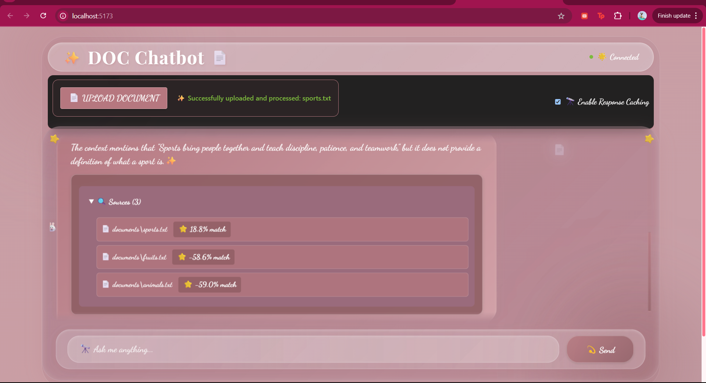

# 📄 DOC Chatbot

Meet **DOC Chatbot**: an intelligent document companion that lets you upload files and ask natural-language questions about them. Instead of manually searching through pages of text, DOC Chatbot uses a **Retrieval-Augmented Generation (RAG)** pipeline to find the most relevant context and generate helpful, source-aware answers.

Built with a modern React interface, a FastAPI backend, Chroma vector search, semantic embeddings, and Groq-powered LLM responses.

The project includes two backend profiles:

- `RAG_PROFILE=render`: Chroma vector RAG with ONNX MiniLM embeddings, designed for Render's free 512 MB backend.
- `RAG_PROFILE=full`: the original full local pipeline using sentence-transformers, LangChain, Torch, and spaCy.

---

## ✨ Features

### 📚 Effortless Document Uploads
- Upload `.txt`, `.md`, `.pdf`, and `.docx` files.
- Automatically extracts, chunks, embeds, and stores document content.
- Processes uploads in the background so the browser does not sit on a long blocking request.
- Includes bundled sample documents so the app works immediately after deployment.

### 💬 Conversational Document Q&A
- Ask questions in a clean chat interface.
- Supports recent conversation history for follow-up questions.
- Keeps uploaded files isolated to the current browser session.
- Streams answers back into the UI.
- Shows source metadata so answers feel transparent and traceable.

### 🔍 RAG Intelligence
- Uses ChromaDB for vector storage.
- Uses semantic vector embeddings for retrieval.
- Combines semantic search with keyword scoring for better document matching.
- Generates answers with Groq's fast chat completion API.

### 🚀 Deployment Ready
- Dockerized FastAPI backend.
- Static React/Vite frontend.
- Render Blueprint included for one-click-style deployment.
- Optional Vercel config included for frontend-only hosting.

---

## 📸 Screenshots

### Chat Interface



### Source-Aware Responses



---

## 🛠️ Tech Stack

### Backend
- FastAPI
- ChromaDB
- ONNX MiniLM embeddings for Render
- LangChain, Sentence Transformers, Torch, and spaCy in the full local profile
- Groq API
- PyPDF2
- docx2txt

### Frontend
- React
- Vite
- Material UI
- Axios
- Custom CSS

### Deployment
- Render for the full app
- Vercel optional for frontend-only deployment
- Docker for the backend API

---

## ⚙️ Local Setup

### 1. Clone the Repository

```bash
git clone https://github.com/Ruchi2117/Doc-Chat-bot.git
cd Doc-Chat-bot
```

### 2. Backend Setup

```bash
cd backend
python -m venv venv
venv\Scripts\activate
pip install -r requirements.txt
copy .env.example .env
```

For the full local pipeline, also install:

```bash
pip install -r requirements-full.txt
```

Add your Groq API key in `backend/.env`:

```env
GROQ_API_KEY=your_groq_api_key_here
```

Run the backend:

```bash
uvicorn main:app --reload
```

Backend runs at:

```text
http://localhost:8000
```

### 3. Frontend Setup

```bash
cd frontend
npm install
copy .env.example .env
npm run dev
```

Frontend runs at:

```text
http://localhost:5173
```

---

## 🔐 Environment Variables

### Backend

```env
GROQ_API_KEY=your_groq_api_key_here
RAG_PROFILE=render
CORS_ORIGINS=http://localhost:5173
DOCUMENTS_DIR=documents
VECTORSTORE_PATH=vectorstore
AUTO_PREPARE_DOCUMENTS=true
CHROMA_COLLECTION=doc_chatbot
GROQ_MODEL=llama-3.3-70b-versatile
```

For production demos, `render.yaml` sets `AUTO_PREPARE_DOCUMENTS=false` so the bot answers only from documents uploaded in that browser session.

### Frontend

```env
VITE_API_URL=http://localhost:8000
```

---

## ☁️ Deployment

The recommended deployment is **Render** because this project has both:

- a static frontend
- a Dockerized FastAPI backend with vector RAG dependencies

This repo includes a `render.yaml` Blueprint that creates:

```text
Frontend: https://ruchi-doc-chatbot.onrender.com
Backend:  https://ruchi-doc-chatbot-api.onrender.com
```

During Render setup, add your secret:

```env
GROQ_API_KEY=your_groq_api_key_here
```

Render uses `RAG_PROFILE=render`, which keeps the RAG workflow but avoids loading Torch and spaCy into the 512 MB free backend.

The deployed frontend sends a tab-specific `session_id` with uploads and questions, so one session's uploaded files are not mixed with another session's files.

Full deployment steps are in:

📘 [DEPLOYMENT.md](DEPLOYMENT.md)

---

## 🧪 Production Notes

- Render free backend services can sleep after inactivity, so the first request may take a little longer.
- Free Render services use an ephemeral filesystem, so uploaded files can reset after redeploys or restarts.
- For a stronger long-term deployment, upgrade the backend service and attach a persistent disk.

Persistent disk environment values:

```env
DOCUMENTS_DIR=/app/data/documents
VECTORSTORE_PATH=/app/data/vectorstore
```

---

## 📂 Project Structure

```text
Doc-Chat-bot/
├── backend/
│   ├── documents/          # Sample documents and screenshots
│   ├── main.py             # FastAPI app
│   ├── prepare_data.py     # Document loading and vectorstore updates
│   ├── prepare_data_full.py # Original full local document processor
│   ├── rag_pipeline.py     # Retrieval and answer generation pipeline
│   ├── rag_pipeline_full.py # Original full local RAG pipeline
│   ├── llama_helper.py     # Groq API helper
│   └── requirements.txt
├── frontend/
│   ├── src/
│   │   ├── App.jsx
│   │   ├── App.css
│   │   └── main.jsx
│   └── package.json
├── backend.Dockerfile
├── docker-compose.yml
├── render.yaml
├── vercel.json
└── DEPLOYMENT.md
```

---

## 🙌 Acknowledgments

- [Groq](https://groq.com/) for fast LLM responses
- [LangChain](https://www.langchain.com/) for RAG tooling
- [Chroma](https://www.trychroma.com/) for vector storage
- The open-source community for the libraries that make this stack possible

---

Crafted with care by **Ruchi Shaktawat**.

Thank you for checking out DOC Chatbot!
